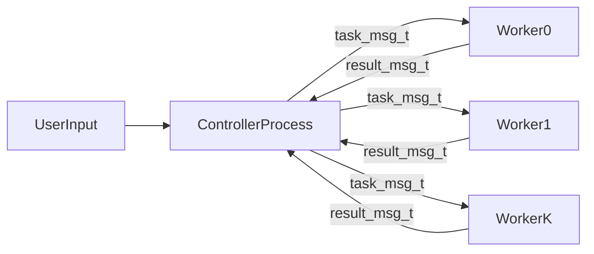

# CSC209 Assignment 3 Project Report

## Project Title

Monte Carlo Pi Estimator with Multi-Process Worker Pool (Pipes)

## Category

Category 1 - Multi-Process Application Using Pipes

## Team

- Team name: `<fill in>`
- Members: `<fill in>`

---

## 5.1 Project Overview

### Problem and Objective

This project implements an interactive systems program in C that estimates the value of pi using Monte Carlo simulation. The goal is not algorithmic novelty, but a robust demonstration of core CSC209 systems topics: process creation, inter-process communication using pipes, concurrency, synchronization by blocking I/O, and defensive error handling.

### User-Facing Behavior

The user runs one controller program and interacts through standard input:

- `simulate <N>`: distribute a total of `N` random trials across all currently alive workers
- `setbatch <N>`: set maximum trials carried in each partial simulation result message
- `stats`: query per-worker status counters (tasks completed)
- `workers`: print active worker count (`alive / total`)
- `help`: print command usage
- `quit` or `exit`: request graceful shutdown

The controller prints a summary for each simulation task:

- total responding workers
- total trials actually run
- total hits inside the unit quarter-circle
- pi estimate (`4 * hits / trials`)
- 95% confidence interval
- error relative to `M_PI`

### Why Monte Carlo Works Here

The simulation samples random points uniformly in `[0,1) x [0,1)`. The probability that a point falls in the quarter unit circle (`x^2 + y^2 <= 1`) is approximately the area ratio:

`P(hit) = (pi / 4) / 1 = pi / 4`

So:

`pi ~= 4 * (num_hits / num_trials)`

### Scope and Intent

This application intentionally uses a simple mathematical workload so implementation effort stays focused on systems concerns:

- process orchestration
- pipe protocol design
- failure containment
- resource cleanup

The design satisfies the assignment requirement that at least three workers run concurrently and exchange meaningful data (not just signals) through pipes.

---

## 5.2 Build Instructions

### Environment and Dependencies

- Language: C
- Compiler: `gcc`
- Build tool: `make`
- Libraries: standard C/POSIX + math library (`-lm`)
- No third-party dependencies

The project is designed to run on teach.cs-compatible Linux environments.

### Source Files

- `controller.c`: parent process, command interface, orchestration, aggregation
- `worker.c`: child process workload loop and result reporting
- `montecarlo.h`: shared protocol structs and constants
- `Makefile`: build rules

### Build Commands

```bash
make clean
make
```

Expected output binaries:

- `controller`
- `worker`

### Run Commands

```bash
./controller [num_workers [seed]]
```

Parameters:

- `num_workers` (optional): number of workers to spawn
  - minimum: 3
  - maximum: 64
  - default: 4
- `seed` (optional): base random seed for workers (`worker_i` gets `seed + i`)
  - default: 42

### Example Runs

```bash
./controller
./controller 4
./controller 8 123
```

### Example Interactive Session

```text
Monte Carlo pi Simulator
Spawning 4 worker processes (base seed 42)...
Workers ready. Type 'help' for available commands.
> workers
Active workers: 4 / 4
> simulate 1000000
--- Simulation results (task 1) ---
...
> quit
Shutting down workers...
All workers exited. Goodbye.
```

### Notes

- No input files are required.
- All communication is done in memory through pipes.
- Program behavior remains valid if some workers fail during execution; the controller degrades gracefully.

---

## 5.3 Architecture Diagram

### High-Level Architecture

The program follows a fixed worker-pool model:

1. Controller starts.
2. Controller creates two pipes per worker:
   - task pipe: controller -> worker
   - result pipe: worker -> controller
3. Controller `fork()`s each worker, then each child `execl("./worker", ...)`.
4. Workers block waiting for task messages.
5. On each `simulate` command, controller dispatches one task per alive worker and collects results.
6. On shutdown, controller sends a shutdown control message and waits for children.

### Process/IPC Diagram



### Responsibilities by Component

#### Controller (`controller.c`)

- parse commands
- partition workload
- send tasks
- collect/validate results
- print statistics
- track worker liveness
- recover from per-worker failures
- perform startup rollback on partial failures
- send shutdown and reap children

#### Worker (`worker.c`)

- read task messages
- run local Monte Carlo trials
- write result messages
- exit cleanly on shutdown control message or closed task pipe

#### Shared Protocol (`montecarlo.h`)

- message schemas (`task_msg_t`, `result_msg_t`)
- message type constants and protocol invariants
- protocol invariants used by both sides

### Mapping to Functions

- startup and process creation: `spawn_workers()`
- simulation dispatch/aggregation: `run_simulation()`
- cleanup/shutdown: `shutdown_workers()`
- child loop: `worker main()` + `run_trials()`

---

## 5.4 Communication Protocol

Protocol definitions are centralized in `montecarlo.h` and used by both processes to avoid divergence.

### Protocol Matrix (Communication Complexity Summary)

| Message Type | Direction | Trigger | Frequency | Key Fields | Failure Handling |
|---|---|---|---|---|---|
| `TASK_SIMULATE` | Controller -> Worker | User runs `simulate N` | One request per alive worker per simulation task | `version`, `task_id`, `msg_type`, `num_trials`, `batch_trials` | Write failure marks worker dead; controller continues with remaining workers |
| `TASK_STATUS_REQ` | Controller -> Worker | User runs `stats` | One request per alive worker per stats query | `task_id`, `msg_type` | Write failure marks worker dead |
| `TASK_SHUTDOWN` | Controller -> Worker | User runs `quit`/`exit` | One request per worker during shutdown | `msg_type` | `EPIPE` tolerated; controller still closes FDs and reaps children |
| `RESULT_SIMULATE` | Worker -> Controller | Worker handles `TASK_SIMULATE` | Multiple responses per worker (batched partial results, size configurable by `setbatch`) | `version`, `task_id`, `batch_index`, `batch_total`, `num_trials`, `num_hits` | Controller validates version/type/order/size; protocol failure marks worker dead |
| `RESULT_STATUS` | Worker -> Controller | Worker handles `TASK_STATUS_REQ` | One response per status request | `task_id`, `tasks_completed` | Invalid payload/type marks worker dead |
| `RESULT_ERROR` | Worker -> Controller | Worker receives invalid request or runtime error | As needed | `task_id`, `error_code` | Controller logs error response and can retire worker |

### Message Type A: `task_msg_t`

| Field | Value |
|---|---|
| Direction | Controller -> Worker |
| Encoding | Fixed-width binary struct (`sizeof(task_msg_t)`) |
| Purpose | Send simulate/control request to one worker |
| Payload | `task_id`, `msg_type`, `num_trials` |

Semantics:

- `task_id` is assigned by controller and increases monotonically.
- `msg_type == TASK_SIMULATE` with `num_trials > 0` means simulation work.
- `msg_type == TASK_STATUS_REQ` asks worker for a status reply.
- `msg_type == TASK_SHUTDOWN` means shutdown.

Receiver expectations:

- Worker reads exactly one full struct.
- Worker branches by `msg_type` and replies accordingly.

Error handling:

- Controller write failure (`EPIPE` or other) marks worker dead.
- Worker short read / EOF is treated as shutdown/failure.

### Message Type B: `result_msg_t`

| Field | Value |
|---|---|
| Direction | Worker -> Controller |
| Encoding | Fixed-width binary struct (`sizeof(result_msg_t)`) |
| Purpose | Report simulation/status/error response |
| Payload | `task_id`, `msg_type`, `num_trials`, `num_hits`, `tasks_completed`, `error_code` |

Semantics:

- `task_id` must match the request currently being aggregated.
- For `RESULT_SIMULATE`: `num_trials` and `num_hits` carry trial outcome.
- For `RESULT_STATUS`: `tasks_completed` carries cumulative processed-task count.
- For `RESULT_ERROR`: `error_code` carries worker-side protocol/runtime error.

Receiver expectations:

- Controller reads exactly one full struct for each worker that received a request.
- Controller validates `result.task_id == current_task_id`.
- Invalid or malformed results are discarded.

Error handling:

- Read error/short read/protocol mismatch causes worker to be marked dead and removed from future scheduling.

### Framing and Serialization Rules

- Sender must write exactly `sizeof(struct)` bytes.
- Receiver must read exactly `sizeof(struct)` bytes.
- `read_full`/`write_full` retry on `EINTR`.
- Short transfer is treated as communication failure.

### Protocol Invariants

1. `task_id` is monotonic from controller.
2. `task_msg_t.msg_type` determines meaning (`TASK_SIMULATE`, `TASK_STATUS_REQ`, `TASK_SHUTDOWN`).
3. `RESULT_SIMULATE` enforces `num_hits <= num_trials`.
4. Only workers that got a request are expected to send one response for that request.

### Protocol Design Tradeoff

Fixed-width structs simplify implementation and avoid additional framing logic. This is suitable because both processes are built together for the same platform and ABI in this assignment context.

---

## 5.5 Concurrency Model

### Concurrency Strategy

The program uses process-level parallelism with a persistent worker pool. Workers are long-lived and reused across multiple user commands.

### Why This Is Concurrent

- Multiple workers exist simultaneously after startup.
- During `simulate`, each worker computes independently.
- Total wall-clock time improves compared to serial execution for large `N`.

### Execution Timeline

1. Controller forks all workers up front.
2. Workers block on task pipe `read`.
3. User issues `simulate N`.
4. Controller computes per-worker chunk sizes.
5. Controller sends tasks to all alive workers.
6. Workers compute in parallel.
7. Controller collects results and aggregates.

### Work Partitioning

Given `alive_count` workers:

- `base_chunk = N / alive_count`
- `remainder = N % alive_count`
- First `remainder` alive workers get `base_chunk + 1`, others get `base_chunk`.

Important edge handling:

- If computed chunk is `0`, that worker is skipped for this task.
- For non-zero chunks, each worker returns results in batches of up to `SIM_BATCH_TRIALS` (currently 50,000 trials per message), increasing message frequency and allowing partial-progress reporting.

### Synchronization and Blocking Behavior

- Pipe `read` naturally blocks workers when idle.
- Controller remains responsive to command loop between simulation tasks.
- No shared memory or mutexes are required.

### Worker Failure During Concurrency

If one worker fails mid-run:

- controller marks it dead
- closes worker-specific FDs
- continues aggregation with remaining workers

This is a recoverable degraded-mode behavior, not a global crash.

---

## 5.6 Error Handling and Robustness

This section documents representative bad-runtime behaviors and how the code handles them.

### Case 1: Startup Failure (`pipe` or `fork` fails)

Location: `spawn_workers()`

Behavior:

- startup enters rollback path
- closes every already-created pipe FD
- terminates/reaps already-forked children
- resets worker table state
- returns failure so `main` exits cleanly

Why this matters:

- avoids partial startup with leaked resources
- avoids orphan children and inconsistent worker bookkeeping

### Case 2: Broken Pipe When Sending Task

Location: `run_simulation()`

Behavior:

- if `write_full` fails while sending task:
  - log error
  - mark that worker dead
  - close worker FDs
  - continue with other workers

Why this matters:

- one failed worker does not bring down entire service

### Case 3: Result Read Failure

Location: `run_simulation()`

Behavior:

- if result read is short/EOF/error:
  - mark worker dead
  - close worker FDs
  - ignore that worker's contribution
  - continue collecting remaining results

Why this matters:

- prevents hangs and malformed aggregation

### Case 4: Protocol Mismatch (`task_id` mismatch)

Location: `run_simulation()`

Behavior:

- if worker result has unexpected `task_id`:
  - treat as protocol failure
  - mark worker dead and close FDs
  - discard invalid result

Why this matters:

- prevents stale/corrupted data from corrupting current task statistics

### Case 5: Unexpected Child Exit

Location: `sigchld_handler()`

Behavior:

- handler reaps exited child with `waitpid(..., WNOHANG)`
- marks matching worker not alive
- main execution later performs explicit FD cleanup paths

Why this matters:

- avoids zombie processes during long interactive sessions

### Signal Robustness

- `SIGPIPE` is ignored in controller so broken-pipe writes return errors instead of terminating process.
- `SIGCHLD` handler ensures terminated children are reaped promptly.

### Resource Management Summary

- FD cleanup:
  - centralized cleanup helper (`close_worker_fds`)
  - dead worker path uses helper consistently (`mark_worker_dead`)
  - shutdown attempts close for all worker slots
- Child cleanup:
  - rollback reaps partially spawned children
  - normal shutdown waits for all known child PIDs
- Memory:
  - no heap allocation in core path, reducing memory leak risk

---

## Complexity Justification (Assessment Alignment)

Our communication design intentionally increases complexity in the dimensions highlighted by course staff:

- **Message encoding richness:** both request and response structs include typed payloads, protocol versioning, and batch metadata.
- **Frequency of exchanges:** one `simulate` request now produces multiple `RESULT_SIMULATE` partial responses per worker for non-trivial workloads.
- **Types of messages:** control and data planes are separated with `TASK_*` and `RESULT_*` message families (`SIMULATE`, `STATUS_REQ/STATUS`, `SHUTDOWN`, `ERROR`).
- **Sender/receiver diversity:** controller and workers both send structured control and data messages, not only one-way task/result payloads.
- **Failure semantics:** each message type has explicit validation and error handling (version mismatch, ordering mismatch, short read/write, broken pipes).

This keeps the application domain simple while making the systems communication layer non-trivial and directly aligned with the grading emphasis on communication complexity.

## 5.7 Team Contributions

Replace this section with one short paragraph per member (name + student number + concrete functions/files).

Suggested format:

- **Member A (`<name>`, `<student_number>`):**
  Implemented process creation and IPC setup in `controller.c` (`spawn_workers`, per-worker pipes, startup argument handling), and contributed to `Makefile`.

- **Member B (`<name>`, `<student_number>`):**
  Implemented worker computation and worker-side message loop in `worker.c` (`run_trials`, `read_full`, `write_full`, shutdown handling).

- **Member C (`<name>`, `<student_number>`):**
  Implemented robustness improvements in `controller.c` (rollback path, dead-worker cleanup helpers, protocol validation with `task_id`), and prepared documentation/video script.

If working solo, provide one paragraph describing all completed responsibilities.

---

## Optional Validation Appendix (Useful for Demo/TA Questions)

### Manual Test Checklist

- Build:
  - `make clean && make`
  - confirm no warnings with `-Wall -Wextra`
- Normal operation:
  - `workers`
  - `simulate 10000`
  - `simulate 1000000`
  - `quit`
- Input validation:
  - `simulate`
  - `simulate -1`
  - `simulate 0`
  - `simulate 999999999999`
- Failure handling:
  - kill one worker process during runtime
  - verify controller continues with reduced worker count

### Expected Observations

- more trials generally produce more stable pi estimates
- worker count may decrease after injected failure, but controller remains interactive
- shutdown exits cleanly without hanging

