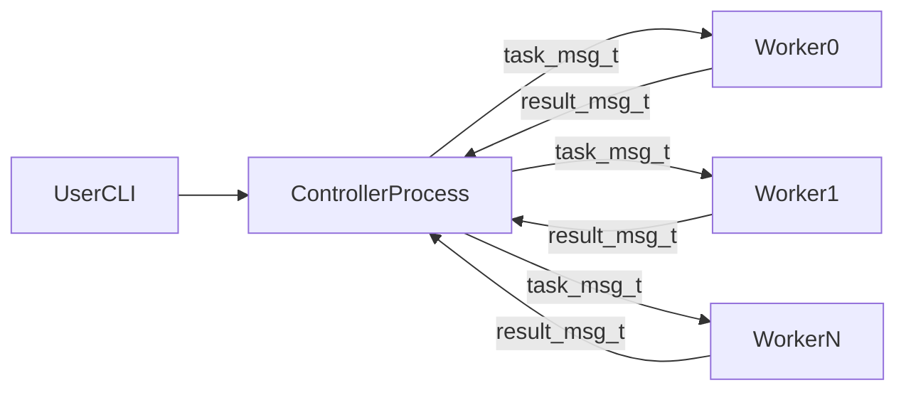

# CSC209 Assignment 3 Project Report

## Project Title

Monte Carlo Pi Estimator with Multi-Process Worker Pool (Pipes)

## Category

Category 1 - Multi-Process Application Using Pipes

---

## 5.1 Project Overview

This project implements an interactive multi-process Monte Carlo simulator in C to estimate the value of pi. The system is composed of one controller process (parent) and multiple worker processes (children). The controller is responsible for spawning workers, distributing simulation tasks, collecting results, and presenting aggregated statistics to the user.

Users interact with the application through a command-line interface:

- `simulate <N>`: run `N` Monte Carlo trials across currently alive workers
- `workers`: show active worker count
- `help`: print available commands
- `quit`/`exit`: gracefully stop workers and terminate

Each worker receives a task message from the controller through a dedicated pipe, performs random trials in `[0,1) x [0,1)`, counts points inside the unit quarter-circle (`x^2 + y^2 <= 1`), and sends a result message back through a result pipe. The controller combines all worker results to compute:

- Pi estimate: `4 * (total_hits / total_trials)`
- 95% confidence interval (normal approximation)
- Error relative to `M_PI`

The project emphasizes systems programming concepts (processes, pipes, synchronization by blocking I/O, and robust failure handling) rather than complex application-layer features.

---

## 5.2 Build Instructions

### Environment

- Language: C
- Compiler: `gcc`
- Standard libraries used on teach.cs-compatible Unix/Linux environments

### Build

```bash
make clean
make
```

This generates:

- `controller`
- `worker`

### Run

```bash
./controller [num_workers [seed]]
```

Examples:

```bash
./controller
./controller 4
./controller 6 123
```

Constraints:

- `num_workers >= 3`
- `num_workers <= 64`

### Typical Session

```text
> workers
> simulate 1000000
> simulate 500000
> quit
```

No additional input files are required.

---

## 5.3 Architecture Diagram (text description)

The implementation uses a fixed worker-pool architecture with one controller and `N` workers.

- Controller process:
  - Reads user commands
  - Sends one `task_msg_t` to each active worker over controller->worker task pipes
  - Reads one `result_msg_t` from each worker that received a task over worker->controller result pipes
  - Aggregates and prints simulation summary

- Worker process `i`:
  - Blocks on read from its task pipe
  - Executes local Monte Carlo trials on each task
  - Writes result message to its result pipe
  - Exits on shutdown sentinel

Mermaid version (can be rendered in markdown viewers that support Mermaid):



Files/functions implementing this architecture:

- `controller.c`: `spawn_workers()`, `run_simulation()`, `shutdown_workers()`
- `worker.c`: `main()` loop, `run_trials()`
- `montecarlo.h`: shared protocol structs

---

## 5.4 Communication Protocol

Protocol definitions are centralized in `montecarlo.h`.

### Message A: `task_msg_t`

- Sender -> Receiver: controller -> worker
- Encoding: fixed-width binary struct written as `sizeof(task_msg_t)` bytes
- Fields:
  - `uint32_t task_id`
  - `uint32_t num_trials`
- Semantics:
  - `task_id`: request identifier assigned by controller (monotonically increasing)
  - `num_trials > 0`: run this many Monte Carlo trials
  - `num_trials == 0`: shutdown sentinel (`SHUTDOWN_SENTINEL`)
- Error handling:
  - If controller write fails (`EPIPE`/other), worker is marked dead and excluded from further tasks

### Message B: `result_msg_t`

- Sender -> Receiver: worker -> controller
- Encoding: fixed-width binary struct written as `sizeof(result_msg_t)` bytes
- Fields:
  - `uint32_t task_id`
  - `uint32_t num_trials`
  - `uint32_t num_hits`
- Semantics:
  - Worker reports completion for one task
  - Controller verifies `result.task_id == current_task_id`
  - Controller aggregates all valid results into global estimate
- Error handling:
  - Short read / EOF / read error / task_id mismatch -> treat worker as failed and continue with remaining workers

### Read/Write Invariants

- Sender must write exactly one full struct payload (`write_full`)
- Receiver must read exactly one full struct payload (`read_full`)
- Partial transfers are treated as communication failure

Code references:

- `montecarlo.h` (protocol schema + invariants)
- `controller.c` (`run_simulation()`, `shutdown_workers()`)
- `worker.c` (`main()`, `write_full()`, `read_full()`)

---

## 5.5 Concurrency Model

The concurrency model is process-based parallelism with a fixed worker pool.

1. Startup:
   - Controller forks all workers in `spawn_workers()` before processing user commands.
   - At least 3 workers run concurrently (assignment requirement satisfied by argument validation and default 4 workers).

2. Synchronization:
   - Workers block on `read()` from task pipes until a task arrives.
   - Blocking pipe I/O naturally synchronizes task dispatch and result collection.

3. Task execution:
   - On `simulate N`, controller partitions `N` across alive workers.
   - Each worker computes its chunk independently in parallel.
   - Controller collects responses and computes combined statistics.

4. Process lifecycle:
   - Unexpected worker exits are reaped in `sigchld_handler()` with `waitpid(..., WNOHANG)`.
   - Graceful shutdown sends sentinel tasks and then waits for children in `shutdown_workers()`.

This model avoids serial fork-wait behavior and demonstrates meaningful concurrent computation.

---

## 5.6 Error Handling and Robustness

This section summarizes key bad-runtime behaviors and corresponding handling.

### Case 1: Startup resource failure (`pipe`/`fork` failure)

- Location: `spawn_workers()`
- Behavior:
  - On any startup failure, controller enters rollback path
  - Closes all pipe FDs opened so far
  - Terminates/reaps already spawned children
  - Resets worker bookkeeping and returns failure to `main`
- Benefit: avoids FD leaks and orphan child processes during partial startup

### Case 2: Broken task pipe during dispatch

- Location: `run_simulation()`
- Behavior:
  - If task write fails (`EPIPE` or other write error), controller marks that worker dead and closes worker FDs
  - Simulation continues with remaining workers
- Benefit: single-worker failure is recoverable; service degrades gracefully

### Case 3: Result read failure or protocol mismatch

- Location: `run_simulation()`
- Behavior:
  - If result read is short/EOF/error, or `result.task_id` is unexpected:
    - worker is marked dead
    - worker FDs are closed
    - result is discarded
  - Aggregation continues using valid worker results
- Benefit: prevents corrupted/stale replies from contaminating computed statistics

### Signals and process robustness

- `SIGPIPE` ignored in controller so writes to dead workers return errors instead of killing controller
- `SIGCHLD` handled to reap unexpected worker exits and keep process table clean

---

## 5.7 Team Contributions

Replace this section with one paragraph per team member.

Example format:

- **Member A (name + student number):**
  Implemented process creation, IPC setup, and worker lifecycle management (`spawn_workers`, `shutdown_workers`), and contributed to protocol design.

- **Member B (name + student number):**
  Implemented worker-side simulation logic, robust read/write helpers, and command parsing/validation in controller.

- **Member C (name + student number):**
  Implemented error-handling improvements (rollback path, dead-worker cleanup, task_id validation), created testing scripts, and wrote report/video script.

If working solo, write one paragraph clearly listing all responsibilities completed.

